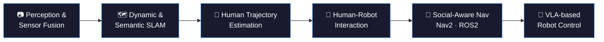

<h1 align="center">Basheer Al-Tawil</h1>

    

  

  🌐 <a href="https://aibomech.github.io/">aibomech.github.io</a> &nbsp;|&nbsp;
  💼 <a href="https://www.linkedin.com/in/basheeraltawil/">LinkedIn</a> &nbsp;|&nbsp;
  ▶️ <a href="https://www.youtube.com/@AIBOMECH">YouTube</a> &nbsp;|&nbsp;
  📧 basheer.al-tawil@ovgu.de &nbsp;|&nbsp;
  📍 Germany

---

###  whoami

PhD Researcher at **Otto von Guericke University Magdeburg (OVGU)** and robotics engineer working on mobile robots that see, understand, and navigate the world alongside people. My research sits at the intersection of **SLAM, perception, and human-aware robot behavior** — building the pipeline that takes raw sensor data all the way to a robot that can safely and naturally operate around humans. Much of this work runs on the **TIAGo** platform, using **ROS2**, **Nav2**, and state machines for task control. Full portfolio, publications, and tutorials at **[aibomech.github.io](https://aibomech.github.io/)**.

### research.focus()

- 📷 **Perception & Sensor Fusion** — fusing RGB-D, LiDAR, and IMU data for robust environment understanding
- 🗺️ **Dynamic & Semantic SLAM** — mapping and localization that accounts for moving objects and scene semantics, not just static geometry
- 🚶 **Human Trajectory Estimation & Action Recognition** — predicting where people are headed and what they're doing, so robots can react appropriately
- 🤝 **Human-Robot Interaction** — designing robot behavior that's legible and comfortable for people sharing the same space
- 🧭 **Social-Aware Navigation** — Nav2 / ROS2-based path planning that respects social norms, not just obstacle avoidance
- 🦾 **VLA for Robot Control** — vision-language-action models for higher-level, instruction-driven robot behavior (TIAGo)

### > stack

  
  
  
  
  
  
  
  

### > stats

  
  

### > echo "let's build"

Open to research collaboration and opportunities in robotics, SLAM, and human-aware AI systems. Reach out via [aibomech.github.io](https://aibomech.github.io/), [LinkedIn](https://www.linkedin.com/in/basheeraltawil/), or [YouTube](https://www.youtube.com/@AIBOMECH).
