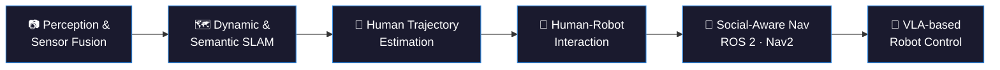

<h1 align="center">Basheer Al-Tawil</h1>

  <strong>Robotics Engineer &amp; PhD Researcher — Mobile Robotics · SLAM · Computer Vision · Vision-Language-Action Models</strong> 
  Otto von Guericke University Magdeburg (OVGU), Germany

    

  
  
  
  

  
  

---

## About

I am a **robotics engineer and PhD researcher** at **Otto von Guericke University Magdeburg (OVGU), Germany**, working on **autonomous mobile robots** that perceive, reason about, and navigate human environments.

My research spans the full autonomy stack — from **multi-sensor perception and sensor fusion** (RGB-D, LiDAR, IMU), through **dynamic and semantic SLAM**, **human trajectory prediction** and **action recognition**, up to **socially-aware navigation** and **vision-language-action (VLA) models** for instruction-driven robot control. Most of this work is deployed on the **PAL Robotics TIAGo** platform using **ROS 2**, **Nav2**, and behavior-tree / state-machine task control.

I care about robotics that actually leaves the lab: real hardware, real sensor noise, real people moving unpredictably through the scene.

📍 Magdeburg, Germany · 🌐 **[aibomech.github.io](https://aibomech.github.io/)** — publications, projects, and tutorials

---

## Research Focus

| Area | What I work on |
| :--- | :--- |
| 📷 **Perception & Sensor Fusion** | Fusing RGB-D cameras, 3D LiDAR, and IMU for robust, real-time scene understanding under occlusion and motion blur |
| 🗺️ **Dynamic & Semantic SLAM** | Mapping and localization that reasons about moving objects and scene semantics instead of assuming a static world |
| 🚶 **Human Trajectory Prediction & Action Recognition** | Anticipating where people are heading and what they are doing, so the robot can plan ahead rather than react late |
| 🤝 **Human-Robot Interaction (HRI)** | Designing robot motion and behavior that is legible, predictable, and comfortable for people sharing the same space |
| 🧭 **Socially-Aware Navigation** | ROS 2 / Nav2 planning that respects proxemics and social norms — not just collision avoidance |
| 🦾 **VLA / VLM for Robot Control** | Vision-language-action and vision-language models for natural-language, instruction-driven manipulation and navigation on TIAGo |
| 🧠 **LLMs in Robotics** | Grounding large language models into executable robot task plans with verifiable, safe execution |

---

## Featured Work

> 📌 Pinned repositories below — full project write-ups and demo videos at **[aibomech.github.io](https://aibomech.github.io/)**

| Project | Description | Stack |
| :--- | :--- | :--- |
| **[Project name]** | One-line outcome-focused summary — e.g. *Semantic SLAM pipeline for dynamic indoor environments, evaluated on TIAGo.* | ROS 2 · C++ · PyTorch |
| **[Project name]** | *Socially-aware navigation layer integrating human trajectory prediction into Nav2 costmaps.* | ROS 2 · Nav2 · Python |
| **[Project name]** | *VLA-driven task execution: natural-language instructions to grounded robot actions.* | PyTorch · Transformers · ROS 2 |

---

## Publications & Talks

Peer-reviewed work in mobile robotics, SLAM, and human-aware navigation.

- 📄 **[Paper title]** — *Venue, Year* · [Paper](#) · [Code](#)
- 📄 **[Paper title]** — *Venue, Year* · [Paper](#) · [Code](#)

🔗 Full list: **[Google Scholar](#)** · **[ORCID](#)** · **[ResearchGate](#)**

---

## Tutorials & Community

I publish practical robotics tutorials on **[YouTube @AIBOMECH](https://www.youtube.com/@AIBOMECH)** — ROS 2 fundamentals, Nav2 configuration, SLAM setup, TIAGo simulation, and computer vision for robotics. Aimed at engineers and researchers who want working code, not slideware.

---

## Tech Stack

**Robotics** ROS 2 (Humble/Jazzy) · ROS 1 · Nav2 · MoveIt 2 · Gazebo / Ignition · RViz2 · TF2 · Behavior Trees · SMACH · PAL TIAGo · URDF/Xacro
**Perception & CV** OpenCV · Open3D · PCL · RTAB-Map · ORB-SLAM · YOLO · Segment Anything · Depth estimation · Multi-object tracking
**AI / ML** PyTorch · TensorFlow · Transformers · Hugging Face · VLA & VLM models · LLM integration · ONNX · CUDA
**Languages** Python · C++ · Bash · MATLAB
**Tooling** Docker · Git · Linux (Ubuntu) · CMake · colcon · CI/CD · NumPy · Pandas

  
  
  
  
  
  
  
  
  
  

---

## GitHub Activity

  
  

  

---

## Let's Build Something

I'm open to **research collaborations**, **industry R&D roles**, **PhD/postdoc partnerships**, and **speaking or tutorial work** in mobile robotics, SLAM, perception, and embodied AI.

  <a href="https://aibomech.github.io/"><b>Portfolio</b></a> ·
  <a href="https://www.linkedin.com/in/basheeraltawil/"><b>LinkedIn</b></a> ·
  <a href="https://www.youtube.com/@AIBOMECH"><b>YouTube</b></a> ·
  <a href="mailto:basheer.al-tawil@ovgu.de"><b>basheer.al-tawil@ovgu.de</b></a>

---

  
    <b>Focus areas:</b> Robotics Engineer · PhD Researcher · Mobile Robotics · Autonomous Navigation · SLAM · Visual SLAM · Semantic SLAM · Dynamic SLAM · ROS 2 · Nav2 · MoveIt · Gazebo · Computer Vision · Sensor Fusion · LiDAR · RGB-D · Point Cloud Processing · Deep Learning · PyTorch · Vision-Language-Action Models (VLA) · Vision-Language Models (VLM) · Large Language Models (LLM) · Embodied AI · Human-Robot Interaction (HRI) · Social Navigation · Human Trajectory Prediction · Action Recognition · Motion Planning · TIAGo · PAL Robotics · Magdeburg · Germany
  

