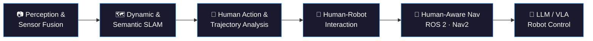

<h1 align="center">Basheer Al-Tawil</h1>

  <strong>Robotics Engineer &amp; PhD Researcher — Mobile Robotics · SLAM · Computer Vision · Human-Robot Interaction</strong> 
  Neuro-Information Technology (NIT), Otto von Guericke University Magdeburg, Germany

    

  
  
  
  

  
  
  
  

---

## About

I am a **robotics engineer and PhD researcher (Doktorand)** in the **Neuro-Information Technology (NIT)** group at **Otto von Guericke University Magdeburg, Germany**, working on **autonomous mobile robots** that perceive, reason about, and navigate human environments.

My work spans the full autonomy stack — **multi-sensor perception and fusion** (RGB-D, 2D/3D LiDAR, IMU), **visual, dynamic, and semantic SLAM**, **human action recognition** and **engagement estimation**, through to **human-aware navigation** and **LLM/VLA-driven robot task control**. Systems are validated in simulation and on real hardware, primarily the **PAL Robotics TIAGo** platform, using **ROS / ROS 2** and **Nav2**.

Published in *Sensors*, *Frontiers in Robotics and AI*, *Robotics*, and *Complex & Intelligent Systems*. Research supported by the **German Federal Ministry of Education and Research (BMBF)** and the **German Research Foundation (DFG)**.

📍 Magdeburg, Germany · 🌐 **[aibomech.github.io](https://aibomech.github.io/)** — projects, publications, and tutorials

---

## Research Focus

| Area | What I work on |
| :--- | :--- |
| 📷 **Perception & Multi-Sensor Fusion** | Late-fusion of RGB-D point clouds with 2D LiDAR for robust mapping; noise filtering and degeneracy handling |
| 🗺️ **Visual, Dynamic & Semantic SLAM** | RGB-D SLAM that stays accurate when people and objects move through the scene, instead of assuming a static world |
| 🚶 **Human Action Recognition** | ResNet + Bi-LSTM with multi-head attention and optical-flow frame selection for real-time HAR in assistive robotics |
| 🤝 **Human-Robot Interaction (HRI)** | Eye-contact and engagement prediction for efficient, legible interaction between robots and people |
| 🧭 **Navigation & Motion Planning** | ROS / ROS 2 and Nav2 navigation stacks, enhanced Gmapping (EGM), adaptive resampling, real-world TIAGo deployment |
| 🦾 **LLM / VLA for Robot Control** | Integrating large language and vision-language-action models into everyday robot automation and task planning |
| 🦿 **Robot Manipulators & Kinematics** | Kinematic/kinetic analysis, trajectory planning, and grasping for robotic arms |

---

## Featured Repositories

| Repository | Description | Stack |
| :--- | :--- | :--- |
| **[HAR-ResNet-BiLSTM-Attention](https://github.com/basheeraltawil/HAR-ResNet-BiLSTM-Attention)** | Official implementation of the *Sensors* 2025 human action recognition framework — ResNet-18 spatial features, Bi-LSTM temporal modeling, multi-head attention, optical-flow frame selection | PyTorch · Python · OpenCV |
| **[Add your SLAM repo]** | Multi-sensor fusion SLAM with enhanced Gmapping (EGM), evaluated against RTAB-Map on TIAGo | ROS · C++ · Python |
| **[Add your navigation repo]** | ROS 2 / Nav2 navigation stack for human-aware mobile robot operation | ROS 2 · Nav2 · Python |

---

## Tutorials & Community

I publish practical robotics tutorials on **[YouTube @AIBOMECH](https://www.youtube.com/@AIBOMECH)** — ROS and ROS 2 fundamentals, Nav2 configuration, SLAM setup, TIAGo simulation, and computer vision for robotics. Built for engineers and researchers who want working code, not slideware.

---

## Tech Stack

**Robotics** ROS 2 · ROS 1 · Nav2 · MoveIt · Gazebo · RViz · TF2 · Behavior Trees · SMACH · Gmapping · RTAB-Map · PAL TIAGo · URDF/Xacro
**Perception & CV** OpenCV · Open3D · PCL · RGB-D processing · 2D/3D LiDAR · point cloud filtering · optical flow · semantic segmentation · object detection · pose & gaze estimation
**AI / ML** PyTorch · TensorFlow · ResNet · Bi-LSTM · multi-head attention · Transformers · LLM & VLA integration · CUDA
**Languages** Python · C++ · MATLAB · Bash
**Tooling** Docker · Git · Linux (Ubuntu) · CMake · colcon · NumPy · Pandas

  
  
  
  
  
  
  
  
  
  

---

## GitHub Activity

  
  

<!-- Contribution snake: generated by your own snake.yml workflow and served from your repo, so it always loads. -->

  

---

## Let's Build Something

Open to **research collaborations**, **industry R&D roles**, **postdoc partnerships**, and **invited talks or tutorials** in mobile robotics, SLAM, perception, human-robot interaction, and embodied AI.

  <a href="https://aibomech.github.io/"><b>Portfolio</b></a> ·
  <a href="https://scholar.google.com/citations?user=-06CVX4AAAAJ&hl=en"><b>Scholar</b></a> ·
  <a href="https://www.linkedin.com/in/basheeraltawil/"><b>LinkedIn</b></a> ·
  <a href="https://www.youtube.com/@AIBOMECH"><b>YouTube</b></a> ·
  <a href="mailto:basheer.al-tawil@ovgu.de"><b>basheer.al-tawil@ovgu.de</b></a>

---

  
    <b>Research areas:</b> Robotics Engineer · PhD Researcher · Mobile Robotics · Autonomous Navigation · SLAM · Visual SLAM · Semantic SLAM · Dynamic SLAM · RGB-D SLAM · Gmapping · RTAB-Map · ROS · ROS 2 · Nav2 · MoveIt · Gazebo · Computer Vision · Multi-Sensor Fusion · LiDAR · Point Cloud Processing · Deep Learning · PyTorch · Human Action Recognition · Gaze Estimation · Engagement Prediction · Human-Robot Interaction (HRI) · Social Navigation · Motion Planning · Robot Manipulators · Vision-Language-Action (VLA) · Vision-Language Models (VLM) · Large Language Models (LLM) · Embodied AI · TIAGo · PAL Robotics · Neuro-Information Technology · OVGU · Magdeburg · Germany
  

