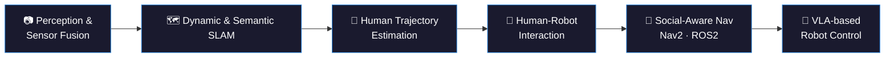

<h1 align="center">Basheer Al-Tawil</h1>

    

  

  🌐 <a href="https://aibomech.github.io/">aibomech.github.io</a> &nbsp;|&nbsp;
  💼 <a href="https://www.linkedin.com/in/basheeraltawil/">LinkedIn</a> &nbsp;|&nbsp;
  ▶️ <a href="https://www.youtube.com/@AIBOMECH">YouTube</a> &nbsp;|&nbsp;
  📧 basheer.al-tawil@ovgu.de &nbsp;|&nbsp;
  📍 Germany

---

### > whoami

PhD Researcher & Robotics Engineer working on mobile robots that see, understand, and navigate the world. Full portfolio, publications, and tutorials at **[aibomech.github.io](https://aibomech.github.io/)**.

### > research.focus()

- Dynamic & Semantic SLAM · Sensor Fusion & Perception
- Human-Robot Interaction · Human Trajectory Estimation · Human Action Recognition
- Social-Aware Navigation with Nav2 · ROS2
- Vision-Language-Action (VLA) models for robot control

### > echo "let's build"

Open to research collaboration and opportunities in robotics, SLAM, and AI. Reach out via [aibomech.github.io](https://aibomech.github.io/), [LinkedIn](https://www.linkedin.com/in/basheeraltawil/), or [YouTube](https://www.youtube.com/@AIBOMECH).
